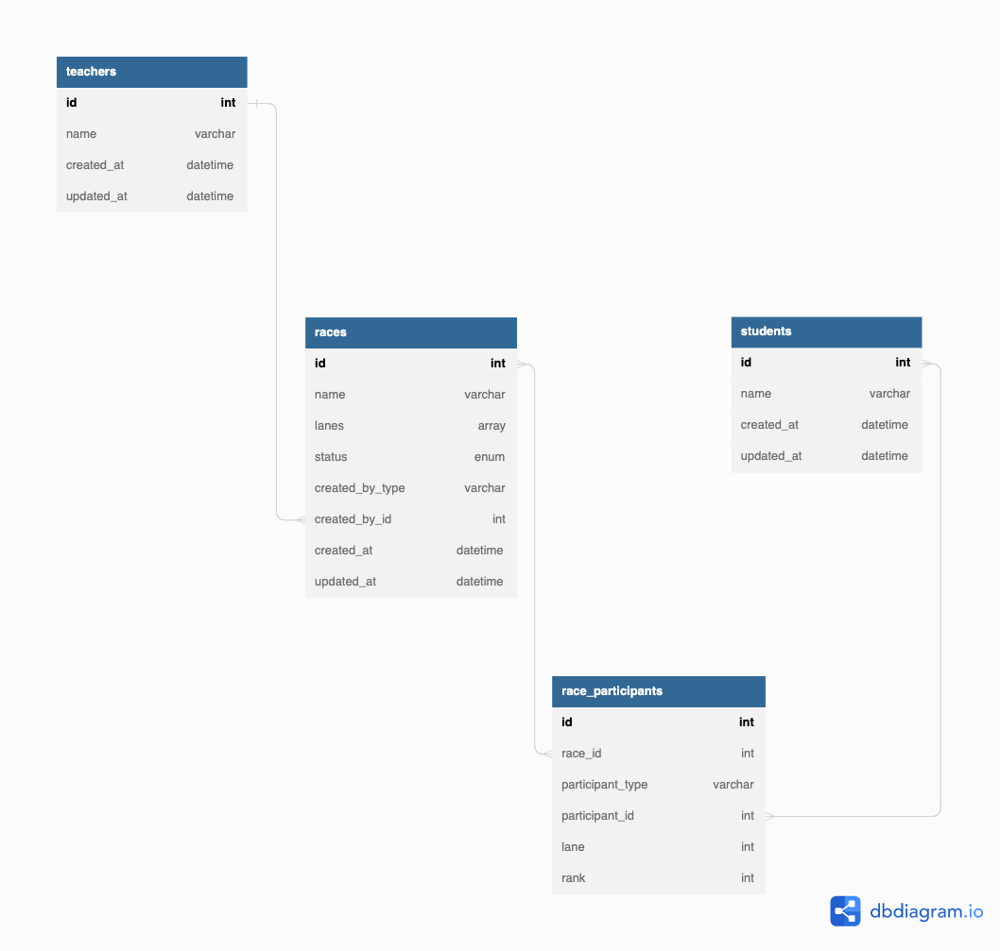

## Introduction
This is an experimental project using mainly [Next.js](https://nextjs.org/) and [Tailwincss](https://tailwindcss.com) with no data fetching from backend APIs.
Staet and Props are handled by `useState` and `useContext`.

The main focus is to allow teachers to create studnets and races. The teacher is to
register studnets into races and record the results.

 :warning:**Warning:**:warning:
It has been a long time since I wrote react. The code does not follow best practices whatsoever.
Big chunck of codes everywhere, big components which can be divided and refactored. No tests. 
Just experiencing how things work as of now. I will be refactoring this repo in the future.

## Getting Started

First, run the development server:

```bash
npm install
npm run dev
# or
yarn && yarn dev
```

Open [http://localhost:3000/admin](http://localhost:3000) with your browser to see the result.

There is no authentication flow.

## Demo

Live demo is also available [here](https://nextjs-experience.vercel.app/admin).

## Diagrams

The following is just a rough [ER diagram](https://dbdiagram.io/d/6356e7c6fa2755667d621a78) of the system.


## Things to work on

- Refactor (standardised duplicated views/funtions, separate out logics stuffed in files from `pages` folder)
- Test cases
- Fix requiring absolute path while importing (E.g `.../.../`)
- look into code splitting
- find out more on how to write better nextjs
- better folder strucutre
- Do authentication
- Add animiaton or good page/action transitions
- come up with better UX
- Typescript
- dockerize
- 404 page
